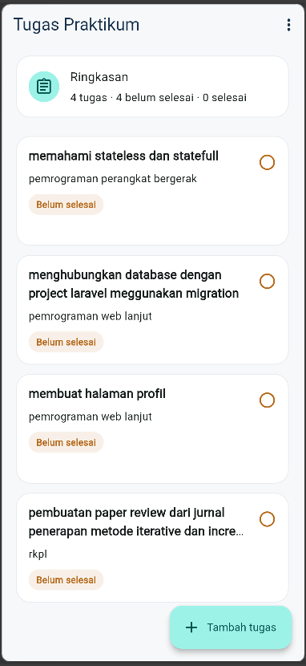
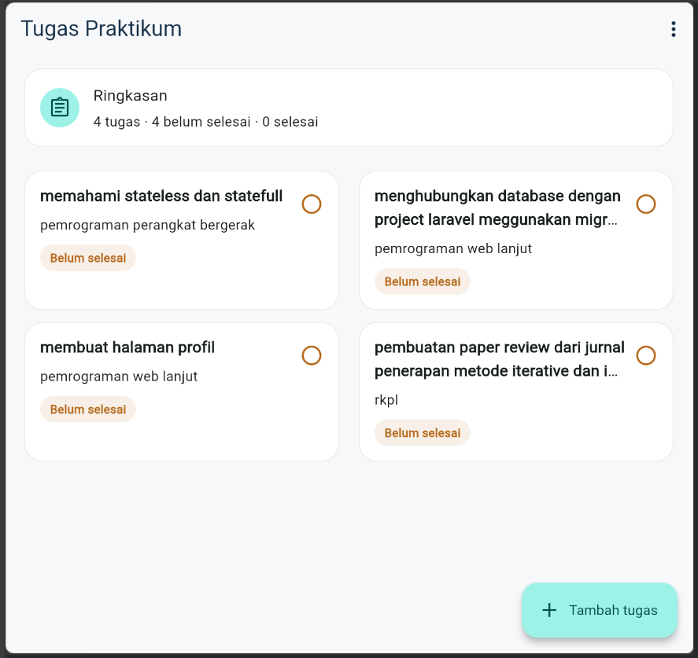

# README UTS Praktikum Pemrograman Perangkat Bergerak

| | |
|---|---|
| Nama | Taufiq Hidayat |
| NIM | (isi NIM) |
| Aplikasi | Tugas Praktikum (pencatat tugas) |
| Tanggal | (isi tanggal ujian) |

---

## 1. Jawaban Teori


### Soal 1 - Daftar tugas dan UI responsif (KAD-1)
Halaman daftar (`TaskListScreen`) menampilkan judul tugas, mata kuliah, status
selesai atau belum selesai pada setiap kartu (`TaskCard`), serta ringkasan
jumlah tugas pada `_SummaryCard` di bagian atas. Jika belum ada data, halaman
menampilkan empty state "Belum ada tugas".

Tata letak responsif dibuat dengan `LayoutBuilder`, yang memberi akses ke
`constraints.maxWidth`, yaitu lebar ruang yang tersedia saat itu. Dari nilai
tersebut jumlah kolom ditentukan: `maxWidth >= 700 ? 2 : 1`. Angka 700 px
adalah batas yang ditetapkan pada soal untuk membedakan layar telepon dan
tablet. Jumlah kolom ini diteruskan ke `GridView.builder` melalui
`SliverGridDelegateWithFixedCrossAxisCount(crossAxisCount: columns)`. Pada lebar
360 px kartu tersusun satu kolom, sedangkan pada lebar 700 px atau lebih kartu
tersusun dalam dua kolom.

Agar tidak terjadi overflow, isi kartu dibungkus `Expanded` di dalam `Row`
sehingga teks hanya memakai sisa lebar setelah tombol status. Judul dibatasi
`maxLines: 2` dan mata kuliah `maxLines: 1` dengan
`overflow: TextOverflow.ellipsis`, jadi teks yang panjang terpotong dengan
tanda "..." dan tidak melebihi tinggi kartu (`mainAxisExtent: 150`).
### Soal 2 - Form, validasi, dan navigasi (KAD-2)
Form tambah tugas (`TaskFormScreen`) memakai widget `Form` dengan
`GlobalKey<FormState>` dan dua `TextFormField`, yaitu judul tugas dan mata
kuliah. Setiap field memiliki `validator` yang memeriksa
`value == null || value.trim().isEmpty`. Metode `trim()` menghapus spasi di awal
dan akhir teks, sehingga input yang hanya berisi spasi dianggap kosong dan
ditolak dengan pesan "Judul tugas wajib diisi." atau "Mata kuliah wajib
diisi.".

Saat tombol Simpan ditekan, `_save()` memanggil
`_formKey.currentState!.validate()`. Jika ada field yang tidak valid, proses
berhenti dan pesan validasi ditampilkan. Jika valid, objek `Task` dibuat dengan
teks yang sudah di-`trim()` lalu dikembalikan ke halaman sebelumnya melalui
`Navigator.pop(context, task)`.

Navigasi dilakukan dengan `Navigator.push`. Halaman daftar membuka form lewat
`await Navigator.push<Task>(...)`. `await` menunggu form ditutup, dan hasilnya
ditampung sebagai `Task?`. Jika pengguna menekan Simpan, nilainya adalah objek
`Task` yang kemudian ditambahkan ke daftar. Jika pengguna menekan Batal, form
ditutup dengan `Navigator.pop(context)` tanpa data, sehingga hasilnya `null`.
Karena kode di halaman daftar menghentikan proses saat hasilnya `null`
(`if (newTask == null || !mounted) return;`), daftar tidak berubah.

Halaman detail dibuka dengan cara yang sama lewat `Navigator.push`. Task yang
dipilih dikirim sebagai parameter konstruktor `TaskDetailScreen(task: task)`,
sehingga halaman detail menampilkan data tugas yang diketuk.

### Soal 3 - State dan interaksi daftar (KAD-3)
Tampilan berubah karena _addTask() dan _toggleTask() memperbarui list _tasks di dalam setState(), sehingga Flutter membangun ulang halaman. Setelah itu daftar disimpan dengan _storage.save(). Angka ringkasan dihitung dari _tasks: total dari _tasks.length, dan yang selesai dari _tasks.where((task) => task.isDone).length (getter _completedCount). Yang belum selesai adalah total dikurangi yang selesai.

### Soal 4 - Operasi asynchronous dan state UI (KAD-4)
Halaman memuat data lewat _loadTasks() yang asinkron. Tampilan ditentukan di _buildTaskContent() dengan urutan pengecekan: jika _isLoading true, tampil CircularProgressIndicator (loading); jika _errorMessage tidak null, tampil pesan error dengan tombol Coba Lagi; jika _tasks kosong, tampil "Belum ada tugas" (empty); selain itu tampil GridView (data). Tombol Coba Lagi memanggil _loadTasks() lagi, yang mengatur _isLoading menjadi true, menghapus pesan error, lalu memanggil _storage.load() ulang.

### Soal 5 - Penyimpanan lokal dan verifikasi (KAD-5)
Model `Task` memiliki dua fungsi untuk konversi data. `toJson()` mengubah objek
Dart menjadi Map, sedangkan `fromJson()` mengubah Map kembali menjadi objek
Dart. Pengubahan antara Map atau List dan String JSON dilakukan di
`TaskStorage` dengan `jsonEncode` dan `jsonDecode`.

Saat tugas ditambahkan, daftar tugas disimpan melalui method `save()` yang
bersifat asinkron. Setiap tugas diubah menjadi Map dengan `toJson()`, seluruh
daftar diubah menjadi satu String JSON dengan `jsonEncode`, lalu String itu
disimpan ke SharedPreferences. Semua data disimpan dalam satu key yang sama
agar `save`, `load`, dan `clear` selalu menunjuk ke tempat yang sama.

Saat aplikasi dibuka, method `load()` dipanggil dari `initState`. `load()`
membaca String JSON dari penyimpanan, mengubahnya menjadi List yang berisi Map
dengan `jsonDecode`, lalu mengubah setiap Map menjadi objek `Task` dengan
`fromJson()` agar datanya dapat dipahami dan dipakai oleh Dart. Hasilnya
dimasukkan ke daftar tugas dengan `setState`, sehingga tampilan dibangun ulang.

Jika data belum pernah disimpan, misalnya saat aplikasi dibuka pertama kali,
`load()` menghasilkan list kosong sehingga tampilan awal kosong. Jika bentuk
data tidak sesuai, misalnya hasil decode bukan List atau isinya bukan Map, maka
`load()` melempar pesan bahwa data tidak sesuai dan tampilan menampilkan state
error.

Untuk verifikasi, saya menjalankan aplikasi dengan perintah
`flutter run -d web-server --web-port=5000`, lalu menambahkan beberapa tugas
dengan status yang berbeda. Setelah itu aplikasi saya tutup dan dibuka kembali.
Hasilnya, tugas-tugas yang dibuat masih ada dengan status yang sama seperti
sebelumnya.

---

## 2. Cara Menjalankan Aplikasi

Prasyarat: Flutter SDK terpasang.

```sh
flutter pub get
flutter run -d web-server --web-port=5000
```

Lalu buka `http://localhost:5000` di browser. 
Port 5000 dipasang secara tetap agar URL dan asal penyimpanan Local Storage / SharedPreferences Web tidak berubah setiap kali aplikasi dijalankan ulang di browser edge

---

## 3. Status Acceptance Criteria

| Kriteria | Status | Cara menguji / catatan |
|---|---|---|
| A. Telepon 360 px tanpa overflow | Berhasil / Belum | |
| B. Tablet >= 700 px dua kolom | Berhasil / Belum | |
| C. Validasi judul dan mata kuliah | Berhasil / Belum | |
| D. Navigasi detail, Simpan, Batal | Berhasil / Belum | |
| E. Tambah dan ubah status langsung terlihat | Berhasil / Belum | |
| F. Loading, empty, data, error, Coba Lagi | Berhasil / Belum | |
| G. Data bertahan setelah aplikasi ditutup | Berhasil / Belum | |
| H. Verifikasi dan bukti | Berhasil / Belum | |

---

## 4. Ringkasan Satu Alur Kode

Alur yang dipilih: 
Menambah tugas baru hingga tersimpan dan muncul kembali saat aplikasi dibuka ulang.

1. Pengguna menekan tombol Tambah tugas di task_list_screen.dart, yang memanggil _addTask().
2. _addTask() membuka TaskFormScreen dengan Navigator.push.
3. Pengguna mengisi form dan menekan Simpan. _save() memvalidasi dengan trim().
4. Jika valid, Navigator.pop(context, task) mengembalikan Task ke halaman daftar.
5. _addTask() membuat list baru [newTask, ..._tasks], memperbarui tampilan dengan setState, lalu memanggil _storage.save(updatedTasks).
6. TaskStorage.save() mengubah tiap Task dengan toJson(), meng-jsonEncode seluruh daftar, dan menuliskannya ke SharedPreferences dengan key tasks_key.
7. Saat aplikasi dibuka lagi, initState memanggil _loadTasks(), yang memanggil TaskStorage.load() untuk membaca, mendekode, dan mengisi _tasks dengan setState.

---

## 5. Bukti Verifikasi

### Langkah uji yang dilakukan
1. Uji Responsif: Mengubah ukuran window browser dari 360 px hingga > 700 px. Hasil: Layout dinamis berubah dari 1 kolom menjadi 2 kolom.

2. Uji Validasi Form: Menginputkan "   " (hanya spasi) pada field judul. Hasil: Pesan "Judul tugas wajib diisi" muncul.

3. Uji Persistensi: Centang tugas dan tambah tugas baru, keluar dari browser dan menggunakan port yang sama untuk menjalankan aplikasi lagi. Hasil: Seluruh data dan status centang tetap bertahan.

4. Uji Simulasi Error: Mengaktifkan titik tiga di pojok kanan pada menu simulasi lalu tekan coba lagi. Hasil: Error state dan tombol "Coba Lagi" tampil dengan benar.

### Keluaran `flutter analyze`
```
Analyzing uts_362558302103_Taufiq_Hidayat...                             

warning - The value of the field '_memory' isn't used. Try removing the field, or
        using it - lib\data\task_storage.dart:15:21 - unused_field
warning - The value of the field '_memory' isn't used. Try removing the field, or
        using it - lib\data\task_storage.dart:15:21 - unused_field

2 issues found. (ran in 4.5s)
```
Catatan penyebab: Warning unused_field muncul karena variabel _memory merupakan kode bawaan (starter template) dari dosen pada task_storage.dart yang disiapkan untuk opsi penyimpanan sementara tetapi tidak dipergunakan karena aplikasi sepenuhnya menggunakan SharedPreferences. Sesuai instruksi ujian, kode bawaan starter tidak dihapus.

### Keluaran `flutter test`
```
flutter test
00:07 +1: D:/dart/uts/uts_362558302103_Taufiq_Hidayat/test/widget_test.dart: Counter increments smoke test
══╡ EXCEPTION CAUGHT BY FLUTTER TEST FRAMEWORK ╞════════════════════════════════════════════════════
The following TestFailure was thrown running a test:
Expected: exactly one matching candidate
  Actual: _TextWidgetFinder:<Found 0 widgets with text "0": []>
   Which: means none were found but one was expected

When the exception was thrown, this was the stack:
#4      main.<anonymous closure> (file:///D:/dart/uts/uts_362558302103_Taufiq_Hidayat/test/widget_test.dart:19:5)
<asynchronous suspension>
#5      testWidgets.<anonymous closure>.<anonymous closure> (package:flutter_test/src/widget_tester.dart:192:15)
<asynchronous suspension>
#6      TestWidgetsFlutterBinding._runTestBody (package:flutter_test/src/binding.dart:1953:5)
<asynchronous suspension>
<asynchronous suspension>
(elided one frame from package:stack_trace)

  file:///D:/dart/uts/uts_362558302103_Taufiq_Hidayat/test/widget_test.dart line 19
The test description was:
  Counter increments smoke test
════════════════════════════════════════════════════════════════════════════════════════════════════
00:07 +1 -1: D:/dart/uts/uts_362558302103_Taufiq_Hidayat/test/widget_test.dart: Counter increments smoke test [E]
  Test failed. See exception logs above.
  The test description was: Counter increments smoke test
  

To run this test again: C:\src\flutter\bin\cache\dart-sdk\bin\dart.exe test D:/dart/uts/uts_362558302103_Taufiq_Hidayat/test/widget_test.dart -p vm --plain-name "Counter increments smoke test"

```
Catatan penyebab: Berkas test/widget_test.dart bawaan dari perintah flutter create adalah tes standar untuk aplikasi bawaan Counter App (yang mencari widget angka "0" dan ikon +). file tersebut tidak dihapus agar bukti kegagalan test tetap terlihat.
### Screenshot
- Ukuran telepon (lebar 360 px): `screenshots/tampilan_mobile.png`
- Ukuran tablet (lebar 700 px atau lebih): `screenshots/tampilan_tablet.png`



---

## 6. Error yang Tersisa
1. Warning unused_field pada _memory. Field dipertahankan karena bawaan starter dan masih dirujuk resetMemoryForTest(). Bisa diperbaiki dengan memberi komentar bila aturan mengizinkan.

2. Test Failure pada widget_test.dart disebabkan File tes bawaan flutter create menguji aplikasi Counter bawaan, bukan aplikasi yang baru dibuat. solusinya file tersebut dihapus jika diperkenankan
---

## 7. Daftar Berkas yang Dikumpulkan

- [ ] `UTS_NIM_Nama.zip` (project Flutter, termasuk `lib/` dan `pubspec.yaml`)
- [ ] `README_UTS.md`
- [ ] Screenshot telepon
- [ ] Screenshot tablet
- [ ] Bukti keluaran `flutter analyze`
- [ ] ZIP sudah dibuka ulang dan dicek sebelum batas waktu
